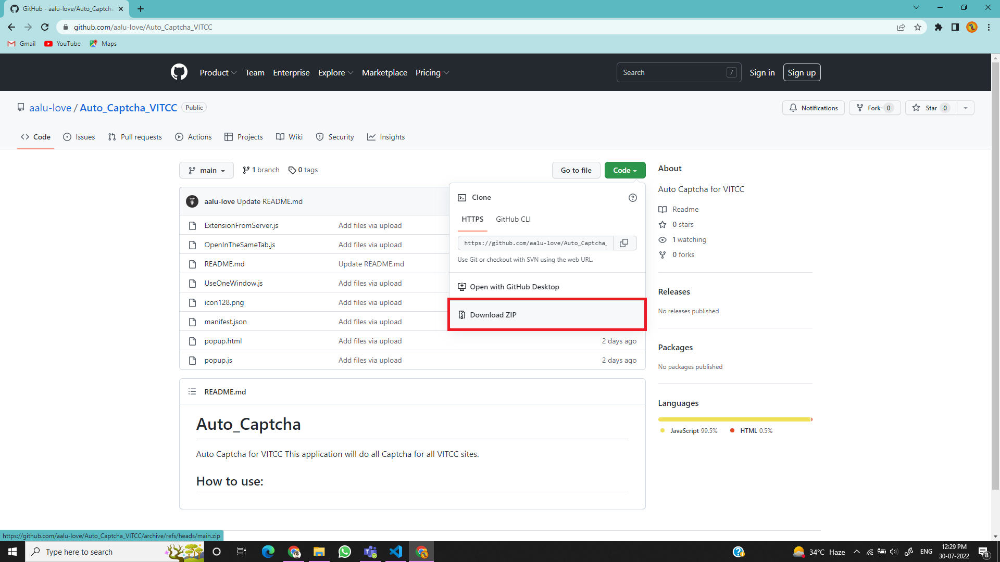
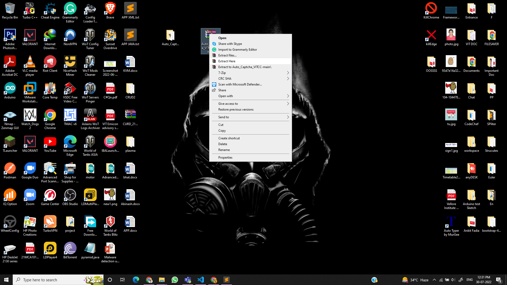
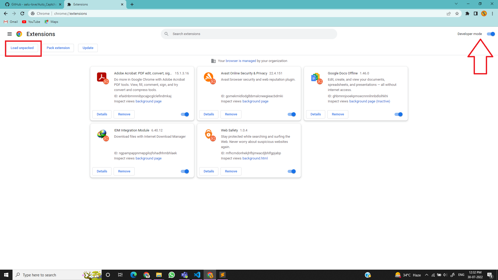
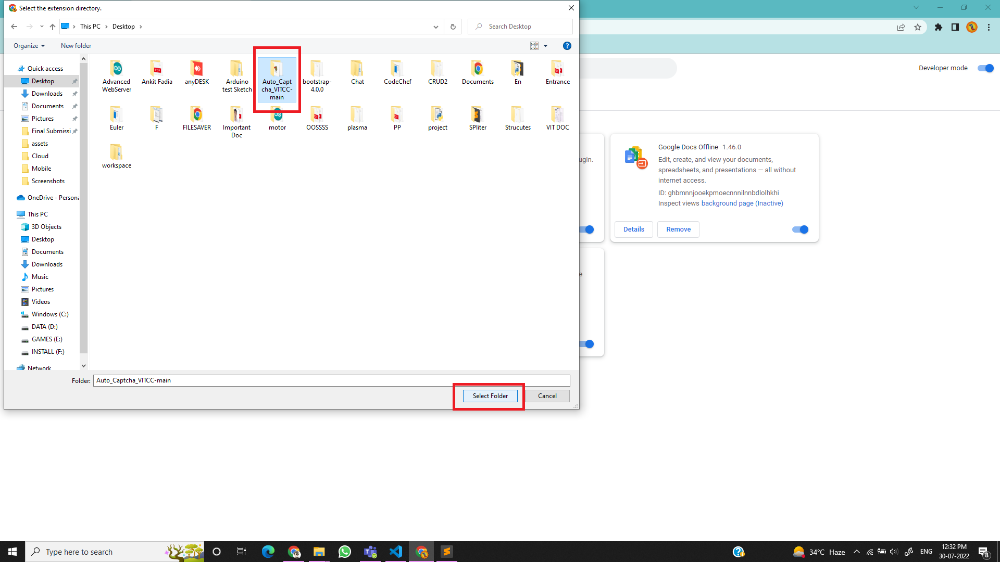

# Auto_Captcha
Auto Captcha for VITCC
This application will do all Captcha for all VITCC sites.
## How to use:
Step 1 : Clone or download the repo.  
 
Step 2 : Extract the zip to your desktop.  
 
Step 3: Go the Chorme and open the Chrome Extension.  
 
Step 4: Enable the developer mode form the here.  
 
Step 5: Load the package and select the folder.  
 

<b> All done Enjoy the App.</b>
